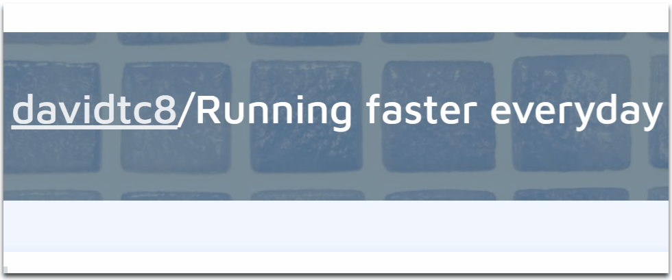

# Habit tracker 🏃‍♂️
Keep track of your habits using Python!

## What does the code do? 🤯
TODO: FILL OUT THIS

## Concepts Applied 🧐:
- [x] HTTP Requests
  
- [x] Lists comprehension 🤓

- [x] Handling Errors

## Code Sneak Peek 😏
